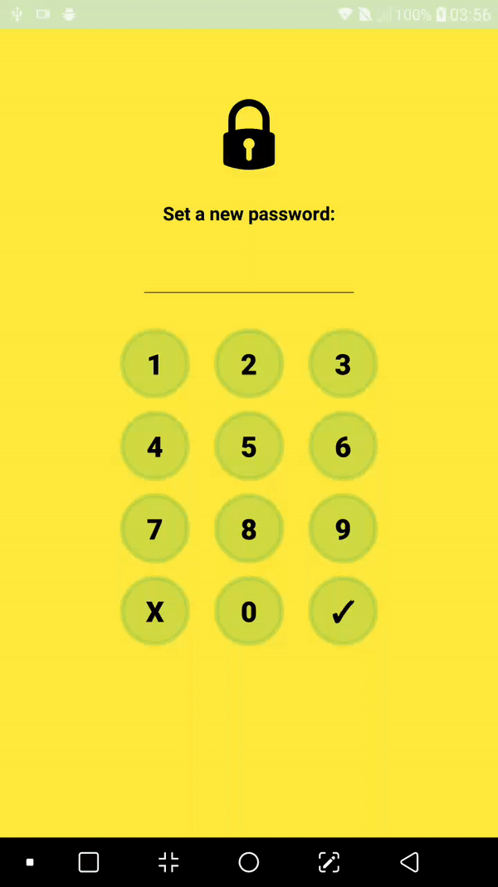
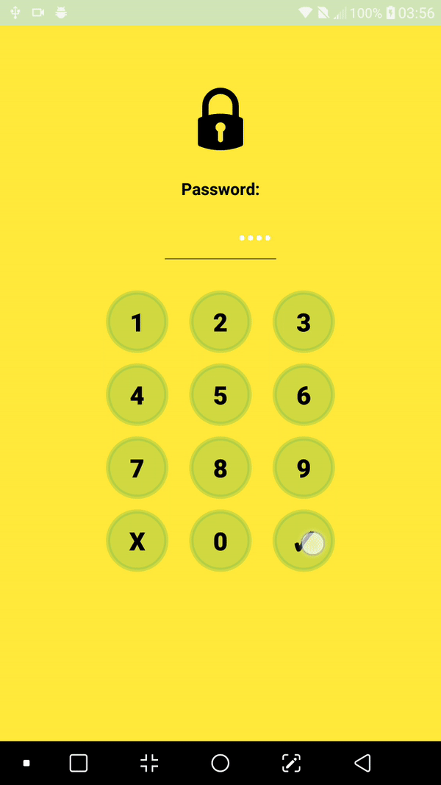

# ScreenLockerApp
Final project - mobile security course

[](https://jitpack.io/#AvrahamRada/ScreenLockerApp)

## Description:
```
My library helps user adding screen locker to there app very easily.
library support 3 kind of operation and can be added in any time and any activity of yours:

1. Set new password.
2. check that the user knows the password (before he can continue using the application).
3. Change your current password.

** In the future, i am planning to add option of slide pass on the buttons, instead of clicking the buttons like it is now.

Thanks a lot to Guy ! :)
Enjoy.

```

## Setup:
Step 1. Add it in your root build.gradle at the end of repositories:
```
allprojects {
    repositories {
          maven { url 'https://jitpack.io' }
    }
}
```

Step 2. Add the dependency:

```
dependencies {
      implementation 'com.github.AvrahamRada:ScreenLockerApp:1.00.01'
}


```
## Usage

Add this line in the activity where you want you screen locker will appear:
```java                    

        MySharedPreferences.init(this);

```



After that check if password has not already set.
If not, call setNewPassword. If yes, call checkPassword:
```java                    

        if (MySharedPreferences.getString("password", null) == null) // Set new password
            ScreenLock.setNewPassword(this, Constants.NUMBERS, SuccessActivity.class);
        else {
            ScreenLock.checkPassword(this, Constants.NUMBERS, SuccessActivity.class);
        }

```


If you want to change the password please call changePassword:
```java                    

        ScreenLock.changePassword(SuccessActivity.this, Constants.NUMBERS, MainActivity.class);

```

   


          
## License

    Copyright 2020 Avraham Rada

    Licensed under the Apache License, Version 2.0 (the "License");
    you may not use this file except in compliance with the License.
    You may obtain a copy of the License at

       http://www.apache.org/licenses/LICENSE-2.0

    Unless required by applicable law or agreed to in writing, software
    distributed under the License is distributed on an "AS IS" BASIS,
    WITHOUT WARRANTIES OR CONDITIONS OF ANY KIND, either express or implied.
    See the License for the specific language governing permissions and
    limitations under the License.

